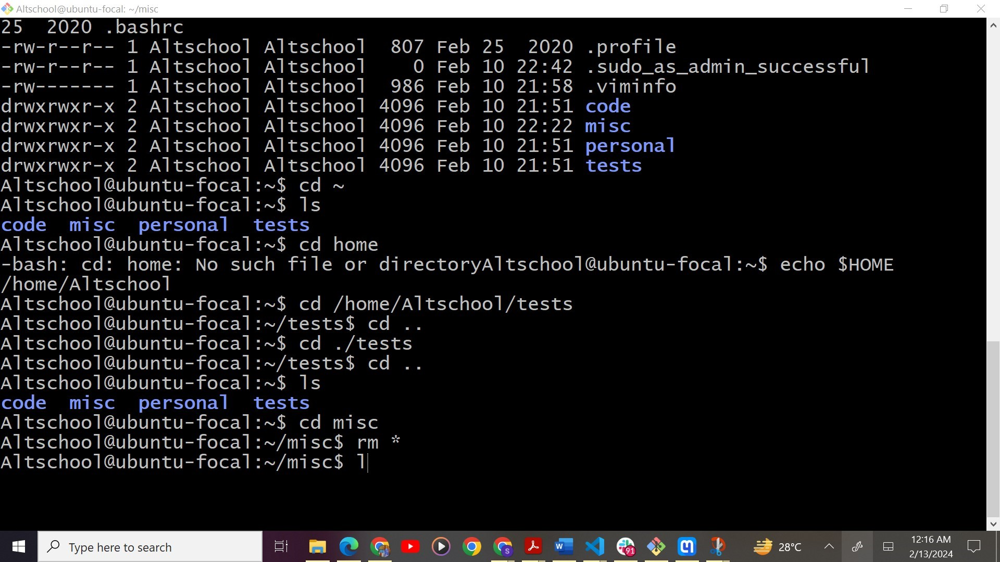
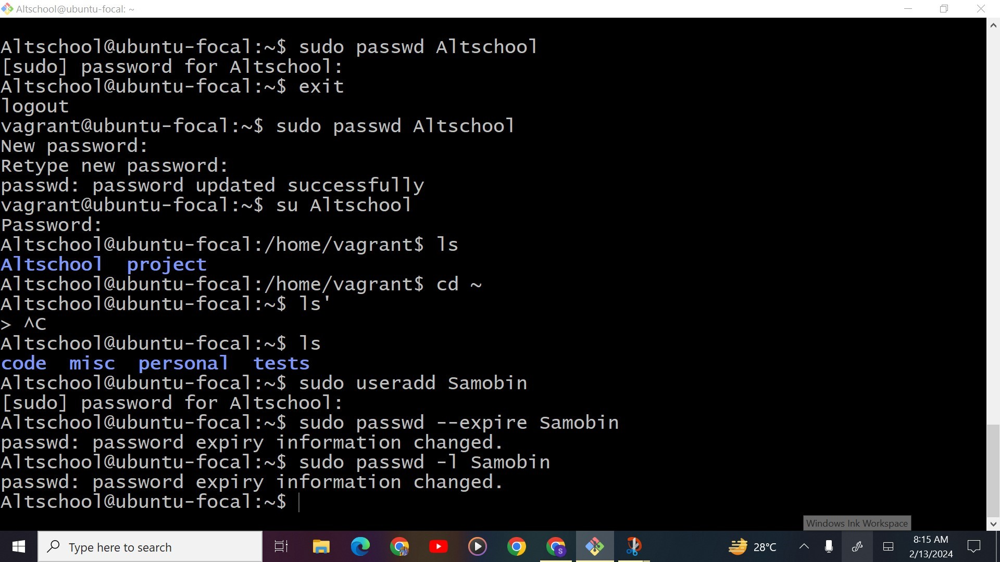

# This is a file containing the screenshots to the assignments:

1. Change directory using absolute path name:
        
        command : `cd /home/Altschool/tests`

2. Change directory using relative pathname:
        
        command : `cd ./tests`
3.  Use echo command to create a named fileA:
        
        command : `echo 'Hello A' >> misc/fileA`
4.  Create an empty fileB and add contents:
        
        command : `touch fileB`
        command : `echo 'My name is....' >> fileB`
5.  Copy fileA to fileC:
        command : `cp fileA fileC`
6.  Move fileB to fileD:
        command : `mv fileB fileD`
7.  Create tar archive:
        
        command : `tar -cf misc.tar *`
8.  Create compress file from tar archive:
        
        command : `gzip misc.tar`
9.  Create compress file from tar archive:
        
        command : `sudo useradd Samobin`
        command : `sudo passwd --expire Samobin`
10.  Create compress file from tar archive:
        
        command : `sudo passwd -l Samobin`
11.  Create compress file from tar archive:
        
        command : `sudo useradd -s /sbin/nologin Temi`
 

12.  Create compress file from tar archive:
        
        command : `sudo vim /etc/ssh/sshd_config`
        Then change `PasswordAuthentication no` 
13.  Create compress file from tar archive:
        
        command : `sudo vim /etc/ssh/sshd_config`
        Then change `PasswordRootLogin no` 

